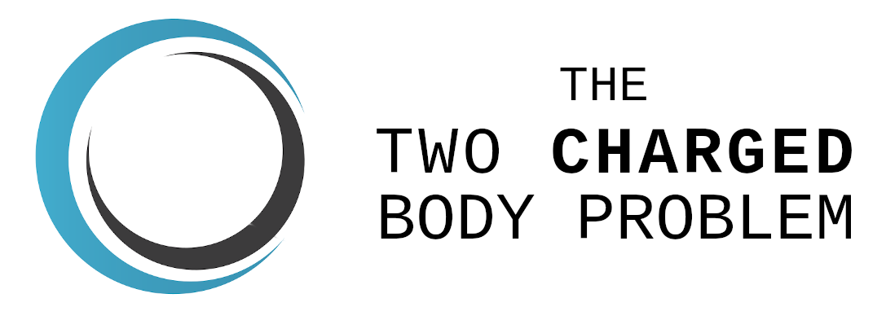

[](http://perso.crans.org/besson/LICENSE.html)

Solve the Newtonian two body problem with charges and radiation reaction and
extract gravitational waves using the quadrupole approximation.


# Installation

Clone this repository:
```bash
   git clone https://github.com/Sbozzolo/two_charged_body_problem.git
```
Move into the folder and install with pip:

```bash
   cd two_charged_body_problem.git && pip3 install --user
```

# Acknowledgments

The logo contains elements designed by
[Vecteezy](https://www.vecteezy.com/free-vector/logo-design-elements").
